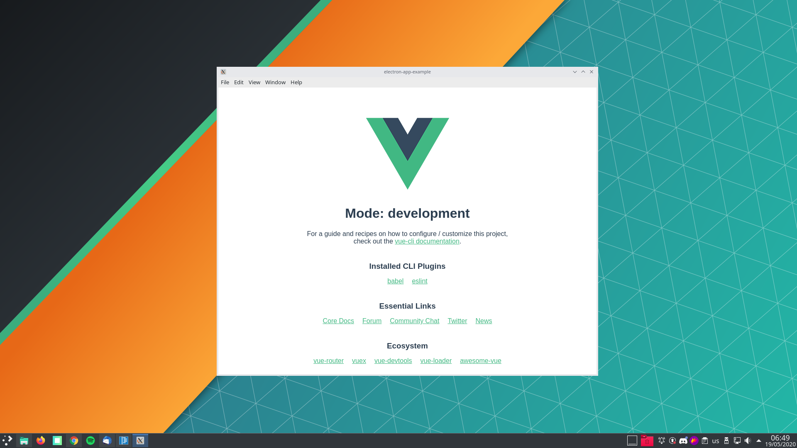

## About
This is a simple example of how to make an electron app using the framework vue

## Project setup
```
npm install
```

### Run vue serve
```
npm run serve
```
### Run electron
```
npm run electron
```

### Compiles and minifies for production
```
npm run build
```
### Run electron in production mode with build files
```
npm run electron
```

### Lints and fixes files
```
npm run lint
```
